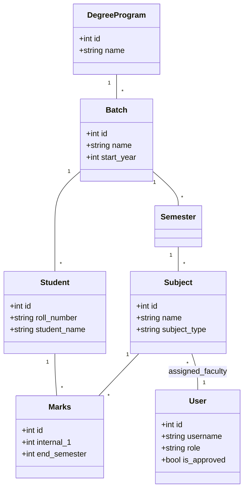
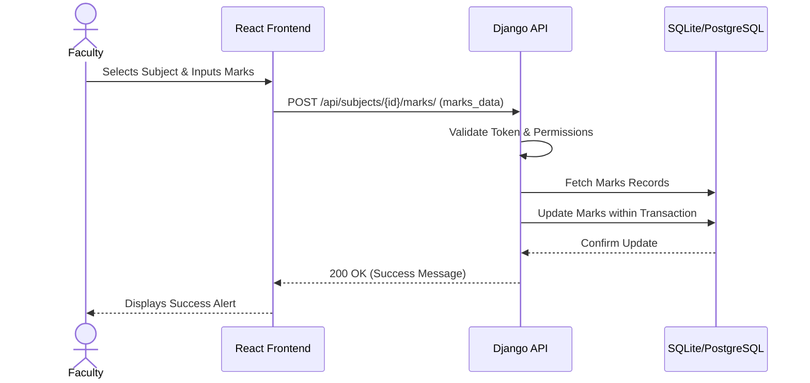
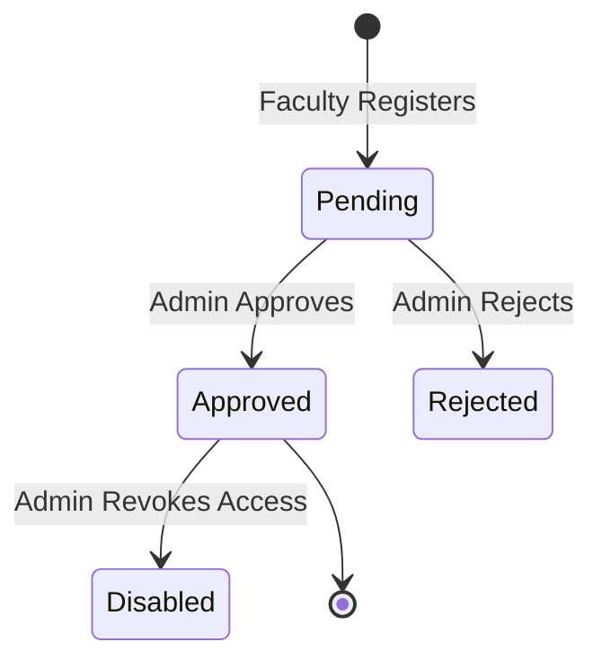

# 7. UML Diagrams

## 7.1 Class Diagram

```mermaid
classDiagram
    class User {
        +int id
        +string username
        +string role
        +bool is_approved
    }
    class DegreeProgram {
        +int id
        +string name
    }
    class Batch {
        +int id
        +string name
        +int start_year
    }
    class Student {
        +int id
        +string roll_number
        +string student_name
    }
    class Subject {
        +int id
        +string name
        +string subject_type
    }
    class Marks {
        +int id
        +int internal_1
        +int end_semester
    }
    
    DegreeProgram "1" -- "*" Batch
    Batch "1" -- "*" Student
    Batch "1" -- "*" Semester
    Semester "1" -- "*" Subject
    Subject "*" -- "1" User : assigned_faculty
    Student "1" -- "*" Marks
    Subject "1" -- "*" Marks
```

## 7.2 Sequence Diagram: Marks Entry

```mermaid
sequenceDiagram
    actor Faculty
    participant UI as React Frontend
    participant API as Django API
    participant DB as SQLite/PostgreSQL
    
    Faculty->>UI: Selects Subject & Inputs Marks
    UI->>API: POST /api/subjects/{id}/marks/ (marks_data)
    API->>API: Validate Token & Permissions
    API->>DB: Fetch Marks Records
    API->>DB: Update Marks within Transaction
    DB-->>API: Confirm Update
    API-->>UI: 200 OK (Success Message)
    UI-->>Faculty: Displays Success Alert
```

## 7.3 State Machine: Faculty Approval

```mermaid
stateDiagram-v2
    [*] --> Pending : Faculty Registers
    Pending --> Approved : Admin Approves
    Pending --> Rejected : Admin Rejects
    Approved --> Disabled : Admin Revokes Access
    Approved --> [*]
```