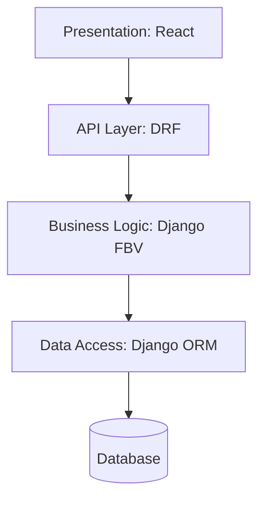

# 10. Layered Architecture

## Overview
The system employs a clear separation of concerns across 5 architectural layers.

1. **Presentation Layer**: React.js, Tailwind CSS, Recharts. Handles UI routing, form validation, and analytics visualization.
2. **API Layer**: Django REST Framework. Serves JSON data via endpoints, handles token authentication, and enforces role-based access.
3. **Business Logic Layer**: Django Function-Based Views (FBVs) and Models. Contains the algorithms for normalizing marks, calculating overall scores, filtering valid faculty, and processing Excel logic.
4. **Data Access Layer**: Django ORM. Abstracts raw SQL, managing relations via Foreign Keys and ensuring constraints (e.g., `unique_together` for Marks).
5. **Database Layer**: SQLite (Development) / PostgreSQL (Production). Persistent storage of structured academic data.

